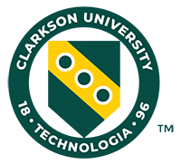

{: .float-right}

# **EE368 Software Engineering**

{: .d-block}

**_(Spring 2021 (10:20AM – 11:10AM Jan. 13, 2021 – Apr. 30, 2021))
(3) Credit Hours_**

---

## **Instructor Contact Information**

Name: Yu Liu  
Office Address: CAMP 166  
Phone Number: (315)268-6510  
Email Address: yuliu@clarkson.edu  
Student Hours: Appointment by Email at anytime

- Will be virtually via Zoom in Spring 2021.

## **Instructor Participation**

During this course, as your instructor, you can expect me to

> - Respond to emails and voicemails within 12 hours
> - Grade activities and assessments within 7 days
> - Be an active participant on the discussion board

### **Delivery Method**

> ### **Online: Synchronous Online by Zoom (<https://clarkson.zoom.us/j/8464946103>) (Note: few students have schedule conflicting with other courses due to the COVID-19 measures in campus and they have the permission to attend this course in async mode. Their presentation can be recorded and played by the team leader.)**

## **Course Description**

Students will participate in managing and executing the process of carrying a significant software development effort from a conceptual idea of new features through integration and testing of the entire feature working on an existed product. This will require them to independently: (a). investigate appropriate technologies, (b). identify relevant risk factors, (c). address issues associated with software quality assurance; Students will produce appropriate documentation of system requirements and design, testing efforts and user interfaces; Students will demonstrate an ability to evaluate the suitability of available technology for use in development of the product; Students will gain experience with issues encountered in maintenance of software systems; Students will be aware of the social and ethical issues of concern to software engineers and the impact of software engineering solutions on modern society; Students will be able to function as an effective member of a team of professionals; Students will gain experience independently learning new technology.

## **Instructional Materials**

> ### **Textbook(s)**
>
> - Software Engineering: The Current Practice, Vaclav Rajlich, CRC Press

## **Technology**

> - ## [Computer System & Software Requirements](https://confluence.clarkson.edu/display/OITKB/Technology+recommendations+for+Distance+and+Online+Learning)
> - ## [Software Accessibility Policies](https://confluence.clarkson.edu/display/OITKB/Accessibility+Statements) in General
> - ## [Software Privacy Policies](https://confluence.clarkson.edu/display/OITKB/Privacy+Policies) in General
> - ## Specific Course Software Policies

> ### **Minimum Technology Skills**
>
> - Use a learning management system
> - Program in the C language
> - Use the Linux Operation System

## **Course Outcomes (CO)**

CO1: Explain the concepts of the software maintenance process and techniques.

CO2: Be familiar with the software maintenance process through the practice in the course project.

CO3: Improve the capability of teamwork, problem solving, risk analysis, etc.

## **Course Success**

Upon success of finishing this course, all assignments need to be submitted on time and requesting help from the instructor if needed.

## **Course Policies**

> ### **Etiquette Expectations & Learner Interaction**
>
> Educational institutions promote the advance of knowledge through positive and constructive debate--both inside and outside the classroom. Please visit and follow: [Netiquette and Electronic Learner Interaction Guidelines](https://intranet.clarkson.edu/administrative/tlc/learner-support/netiquette-and-electronic-learner-interaction-guidelines/).
>
> ### **Late Work**
>
> Late submission will not be graded unless the instructor has been notified with an acceptable reason.
>
> ### **Attendance**
>
> Attendance is important to the success of participating this course. An acceptable reason needs to be emailed to the instructor if you will be absent from the class. Maximum 5 points penalty may be applied through the attendance checking in the semester.
>
> ### **Recorded Lectures**
>
> Regular lectures and presentations will be recorded, and recorded lectures will be uploaded to the moodle for your access. Others will NOT be recorded.

## **Academic Unit Information/Policies**

> Department of Electrical and Computer Engineering, Department Office, CAMP 156

## **Institutional Policies**

### [**Institutional Policies & Regulations**](https://www.clarkson.edu/student-administrative-services-sas/clarkson-regulations)

> ### **Academic Integrity**
>
> Academic Integrity, based on the values of honesty, trust, fairness, respect, and responsibility, is a fundamental principle of scholarship in higher education. Clarkson’s Academic Integrity Policy prohibits: plagiarism (using another person’s writing or copying any work without proper citation), falsification, unauthorized collaboration during a test or on an assignment, or substitution for another student to take an exam, course or test, and other forms of academic dishonesty.
>
> If you are to benefit from this class and be properly evaluated for your contributions, it is important for you to be familiar with and follow Clarkson University’s Academic Integrity policy. Please review this policy online ([Undergraduate section IV – Academic Integrity](https://www.clarkson.edu/student-administrative-services-sas/clarkson-regulations), [Graduate section IV – Academic Integrity](https://www.clarkson.edu/sites/default/files/2020-03/Graduate-Student-Regs_19-20.pdf)). **_Work that violates this policy will not be tolerated_**. Students who are found responsible for a violation of the Academic Integrity Policy will have both a university process sanction and an academic outcome, that could include a failing grade on the assignment or exam, or a failing grade for the course.
>
> Please refer to **Clarkson Library’s [Guide to Plagiarism**](https://sites.clarkson.edu/library/plagiarism/)** and the [**guide to Citing Sources](https://sites.clarkson.edu/library/citing-sources/)\*\* for assistance on avoiding plagiarism and properly citing sources.
>
> ### **Students with Disabilities Requesting Accommodation(s)**
>
> The University strives to make all facilities and programs accessible to students with permanent, ongoing, and temporary disabilities by providing appropriate and reasonable academic accommodations, as necessary. Disabilities that may benefit from reasonable accommodations include, but are not limited to, broken wrist, ADHD, surgery recovery, Learning Disability, concussion, visual impairment, etc. For more information and/or to request accommodations, contact the Office of Accessibility Services at <oas@clarkson.edu> or 315-268-7643.
>
> [Students with Disabilities Policy](https://www.clarkson.edu/policies-and-laws) > [Office of Accessibility Services Website](https://www.clarkson.edu/accessability-services)

### **Other Policies of Note:**

### **Student Regulation Requirements for Excused and Extended Absence**

> [Undergraduate: III-F. Attendance](https://www.clarkson.edu/student-administrative-services-sas/clarkson-regulations) > [Graduate – II-F. Attendance](https://www.clarkson.edu/student-administrative-services-sas/clarkson-regulations)
>
> ### [**Grading System**](https://intranet.clarkson.edu/student-life/sas/grading-system/)
>
> ### [**Discrimination & Harassment**](https://www.clarkson.edu/diversity-and-inclusion-policies)
>
> ### [**Religious Accommodations**](https://www.clarkson.edu/diversity-and-inclusion-policies)
